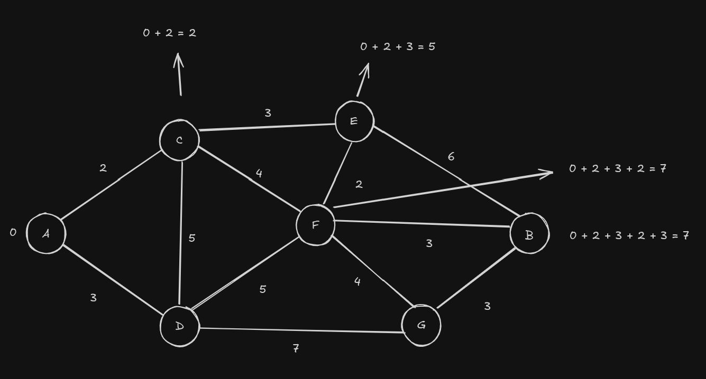

# Dijkstra  Algorithem

## What it actually does ? : 
 - The algorithem is used to find the shortest path, by the shortest path I mean the path to get from point A to point B. Here point A could be your home and point B could be your freinds place to reach your friends place you have different roads each roads have a marked distance. 

 